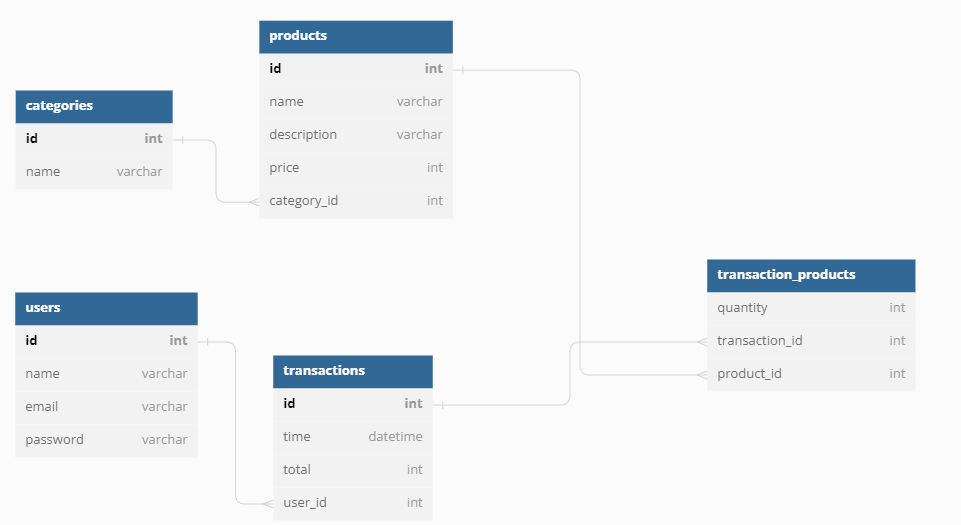

# TPA 4
## ERD

## Study Cases
### Case 1
1 pelanggan membeli 3 barang yang berbeda.
berada pada case-1.sql

### Case 2
Melihat 3 produk yang paling sering dibeli oleh pelanggan.
berada pada case-2.sql

### Case 3
Melihat Kategori barang yang paling banyak barangnya.
berada pada case-3.sql

### Case 4
Nominal rata-rata transaksi yang dilakukan oleh pelanggan dalam 1 bulan terakhir.
berada pada case-4.sql

